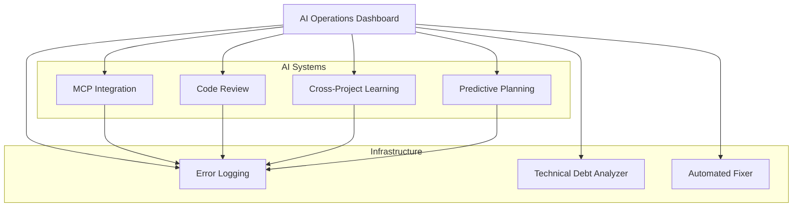
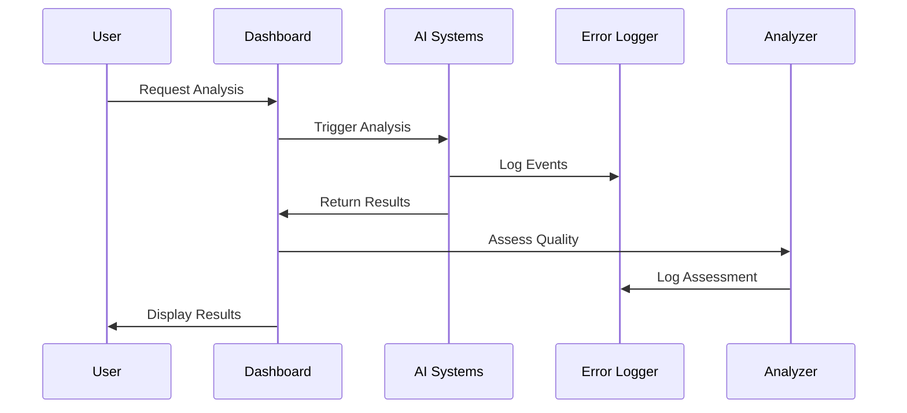
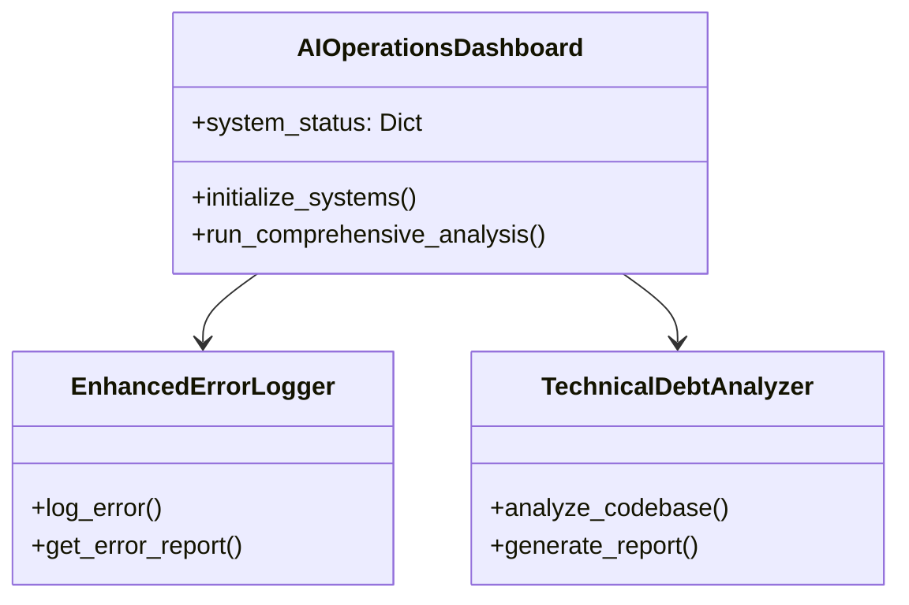

# Component Interaction Diagrams

## System Overview

```mermaid
graph TB
    Dashboard[AI Operations Dashboard]
    
    subgraph "AI Systems"
        MCP[MCP Integration]
        Review[Code Review]
        Learning[Cross-Project Learning]
        Planning[Predictive Planning]
    end
    
    subgraph "Infrastructure"
        ErrorLog[Error Logging]
        DebtAnalyzer[Technical Debt Analyzer]
        AutoFixer[Automated Fixer]
    end
    
    Dashboard --> MCP
    Dashboard --> Review
    Dashboard --> Learning
    Dashboard --> Planning
    
    Dashboard --> ErrorLog
    Dashboard --> DebtAnalyzer
    Dashboard --> AutoFixer
    
    MCP --> ErrorLog
    Review --> ErrorLog
    Learning --> ErrorLog
    Planning --> ErrorLog
```

## Data Flow Diagram

```mermaid
sequenceDiagram
    participant U as User
    participant D as Dashboard
    participant AI as AI Systems
    participant E as Error Logger
    participant A as Analyzer
    
    U->>D: Request Analysis
    D->>AI: Trigger Analysis
    AI->>E: Log Events
    AI->>D: Return Results
    D->>A: Assess Quality
    A->>E: Log Assessment
    D->>U: Display Results
```

## Integration Architecture

```mermaid
classDiagram
    class AIOperationsDashboard {
        +system_status: Dict
        +initialize_systems()
        +run_comprehensive_analysis()
    }
    
    class EnhancedErrorLogger {
        +log_error()
        +get_error_report()
    }
    
    class TechnicalDebtAnalyzer {
        +analyze_codebase()
        +generate_report()
    }
    
    AIOperationsDashboard --> EnhancedErrorLogger
    AIOperationsDashboard --> TechnicalDebtAnalyzer
```
